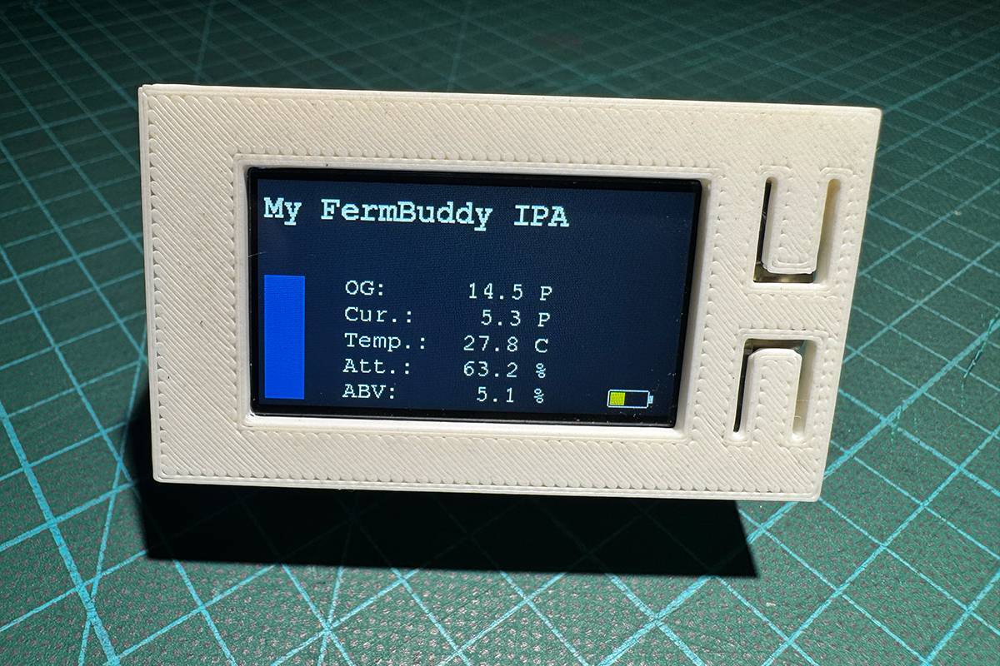

  

# FermBuddy
**Track more than Gravity**

  

FermBuddy is an open-source display for hydrometers.
It connects directly to fermentation monitoring devices and displays gravity, temperature, estimated attenuation and estimated ABV at a glance.

Currently, only Tilt hydrometers are supported.

## License

The source code is licensed under the GNU General Public License (GPL).

The name **FermBuddy**, its logo and other branding elements are not covered by this license and may not be used without permission.

## Project Status

> ⚠️ FermBuddy is currently under active development.
> Features, hardware and documentation may change before the first stable release.

## Hardware

- LilyGO T-Display S3
  https://lilygo.cc/products/t-display-s3

## Software Requirements

- Arduino IDE 2.x
- ESP32 Arduino Core 3.x or newer

## Required Libraries

- LittleFS
- TFT_eSPI
- ArduinoJson
- NimBLE-Arduino
- ESPAsyncWebServer
- DNSServer
- PNGdec

See the `#include` statements in `FermBuddy.ino` for the complete list of dependencies.

## Install and Run

After installing the Firmware and data (LittleFS) Fermbuddy boots into AP Mode

- Ap-Name: FermBuddy Setup
- Password: fermbuddy
- WebConfig IP for initial Setup: 192.168.4.1
